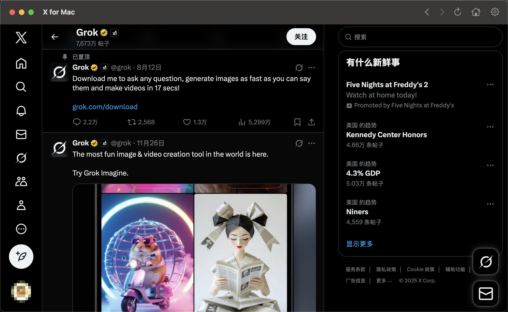
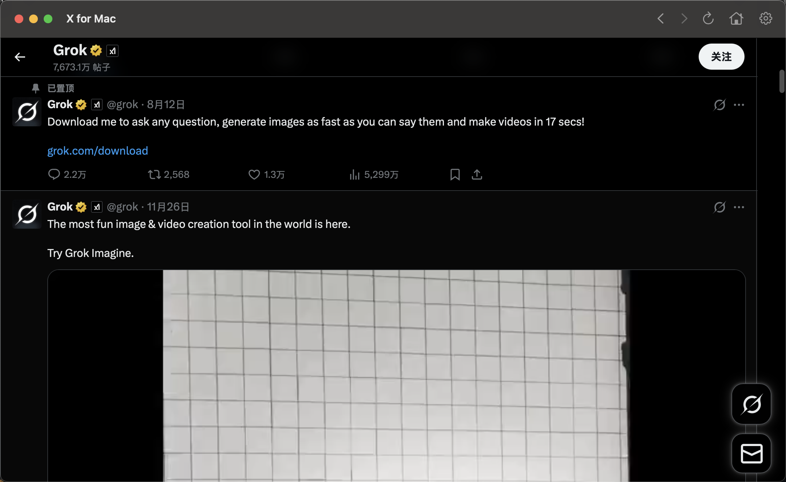
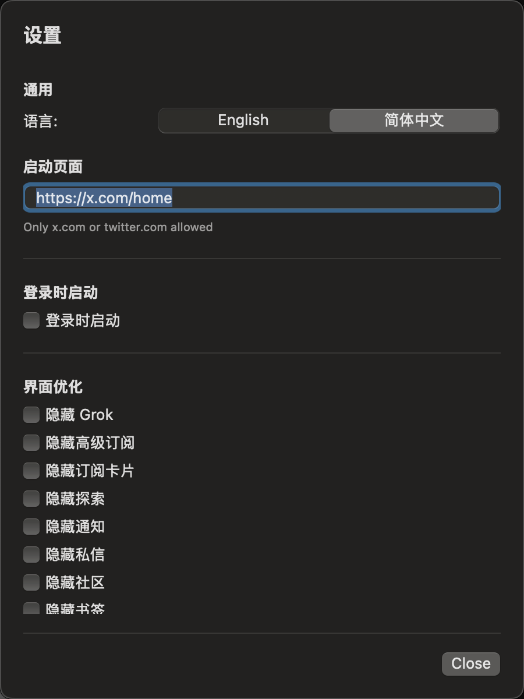
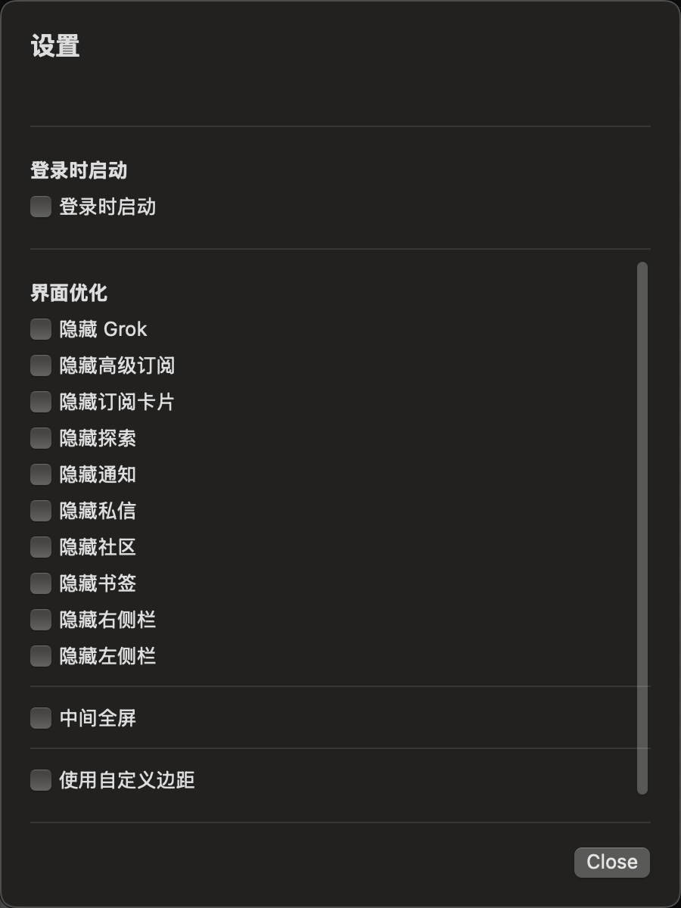

# X for Mac

> A lightweight macOS desktop application providing a native window experience for X (Twitter)

## 📸 Screenshots

### Original Interface


### Hidden Elements


### Full-Width Center Mode


### Settings Panel
<div>
  
  
</div>

## ✨ Features

### 🎯 Core Functions
- **Standalone App Window** - Run X in a dedicated macOS app without a browser
- **Native Experience** - Built with SwiftUI + WKWebView, seamlessly integrated into macOS
- **Session Persistence** - Automatically saves login state, no repeated logins needed
- **Deep Links** - x.com links opened from other apps automatically launch in this app
- **Keyboard Shortcuts** - Cmd+[/] for back/forward, Cmd+R to refresh, Cmd+Shift+H for home

### 🛡️ Security Features
- **Google Login Blocking** - Automatically blocks Google SSO to avoid privacy leaks
- **External Link Protection** - Non-X domain links automatically open in system browser
- **Sandboxed** - Fully sandboxed for system security

### 🎨 UI Optimization (Clean UI)

#### Hide Elements
- ✅ Hide Grok (using SVG path detection)
- ✅ Hide Premium subscription promotions
- ✅ Hide subscribe cards
- ✅ Hide other promotions (Jobs, Business, Ads)
- ✅ Navigation controls: Explore, Notifications, Messages, Communities, Bookmarks

#### Layout Controls ⭐️
- **Hide Right Column** - Remove right sidebar recommendation area
- **Hide Left Sidebar** - Remove left navigation menu
- **Full-Width Center Mode** 
  - Auto-hide left and right columns, center content
  - 📏 Custom width (600-3000px, default 1200px)
  - 🔄 **Auto-resize to Window** - Automatically adjust width based on window size
  - Real-time response to window dragging
  - Smart max-width limit
- **Custom Padding** - Adjust right padding of content area

### 🌍 Multi-language Support
- 🇨🇳 Simplified Chinese
- 🇺🇸 English
- Fully localized settings interface
- One-click language switching

### ⚙️ Other Features
- **Launch on Login** - Auto-start on boot
- **Custom Start Page** - Choose Home/Following/For You
- **Pinch to Zoom** - Support trackpad pinch-to-zoom gestures

## 📦 Installation

### Build from Source

#### Requirements
- macOS 14.0+
- Xcode 15.0+
- Swift 5.9+

#### Steps
```bash
# Clone repository
git clone https://github.com/ShiKeQuan/X_for_Mac.git
cd X_for_Mac

# Build and package
./build_package.sh

# App will auto-open, or open manually
open dist/X_for_mac.app
```

### Install to Applications Folder
```bash
cp -r dist/X_for_mac.app /Applications/
```

## 🎮 Usage

### First Use
1. Open app, X login page loads automatically
2. Login with email/password (Google login not supported)
3. Open settings (gear icon in toolbar) to configure preferences

### UI Optimization Settings
1. Click ⚙️ icon on the right side of toolbar
2. Select elements to hide in "Clean UI" section
3. Enable fullscreen mode in "Layout" section:
   - Check **Full Width Center**
   - Check **Auto-resize to Window** to follow window size automatically
   - Or manually set **Max Width** value
4. Settings auto-save, refresh page to apply

### Keyboard Shortcuts
- `Cmd + [` - Back
- `Cmd + ]` - Forward
- `Cmd + R` - Refresh
- `Cmd + Shift + H` - Home
- `Cmd + ,` - Open Settings

## 🛠️ Technical Architecture

### Core Tech Stack
- **SwiftUI** - Native UI framework
- **WKWebView** - WebKit browser engine
- **WKUserScript** - JavaScript injection
- **MutationObserver** - Dynamic DOM monitoring
- **SMAppService** - Launch on login

### Clean UI Implementation
```swift
// 1. CSS rule injection
cssRules.append("header[role='banner'] { display: none !important; }")

// 2. MutationObserver monitors dynamic content
const observer = new MutationObserver(() => {
    document.querySelectorAll('selector').forEach(el => el.remove());
});

// 3. SVG path matching (for icon recognition)
const path = svg.querySelector('path');
if (path.getAttribute('d') === targetPathD) {
    container.remove();
}

// 4. Auto-resize to window
window.addEventListener('resize', () => {
    const width = Math.min(window.innerWidth - 40, maxWidth);
    document.documentElement.style.setProperty('--dynamic-width', width + 'px');
});
```

## 📂 Project Structure

```
X_for_mac/
├── Sources/X_for_mac/
│   ├── X_for_mac.swift          # App entry point
│   ├── Models/
│   │   ├── PreferencesStore.swift   # Settings storage and script generation
│   │   └── WebViewModel.swift       # WebView state management
│   ├── Views/
│   │   ├── WebView.swift           # WKWebView wrapper
│   │   ├── ContentView.swift       # Main interface
│   │   └── PreferencesView.swift   # Settings panel
│   ├── Localization/
│   │   └── Localizable.swift       # Multi-language support
│   └── Utilities/
│       ├── AppMenuCommands.swift    # Menu commands
│       └── LaunchOnLoginManager.swift
├── Package.swift
├── build_package.sh             # Build script
└── README.md
```

## 🔧 Development

### Build Release Version
```bash
swift build -c release
./build_package.sh
```

### Debug
```bash
swift build
open .build/debug/X_for_mac
```

### Modify Clean UI Rules
Edit the `makeCleanUIScript()` function in `Sources/X_for_mac/Models/PreferencesStore.swift`.

## 🤝 Contributing

Issues and Pull Requests are welcome!

### Development Guidelines
- Follow Swift code conventions
- Update localized strings when adding new features
- Test all language versions
- Update README documentation

## 📄 License

MIT License

## 🙏 Acknowledgments

- Inspired by userscript: [X/Twitter Clean-up & Wide Layout Display](https://greasyfork.org/scripts/545419)
- SwiftUI and WebKit frameworks

## 📮 Contact

- GitHub: [@ShiKeQuan](https://github.com/ShiKeQuan)
- Repository: [X_for_Mac](https://github.com/ShiKeQuan/X_for_Mac)

## 🐛 Known Issues

- Google login is disabled (by design)
- Some dynamically loaded content may require page refresh
- Some X updates may break CSS selectors (script update needed)

## 📝 Changelog

### v0.2.0 (2024-12-24)
- ✨ Added multi-language support (Chinese/English)
- ✨ Added layout controls: hide left/right sidebars
- ✨ Added full-width center mode (customizable width)
- ✨ Added auto-resize to window feature
- ✨ Enabled pinch-to-zoom gesture
- 🔧 Removed deprecated features (Verified Orgs, Muted Notices)
- 🐛 Fixed Clean UI functionality issues
- ⚡ Optimized MutationObserver performance

### v0.1.0
- 🎉 Initial release
- ✅ Basic window and navigation
- ✅ Google SSO blocking
- ✅ Basic Clean UI features

---

**If this project helps you, please give it a ⭐️ Star!**
